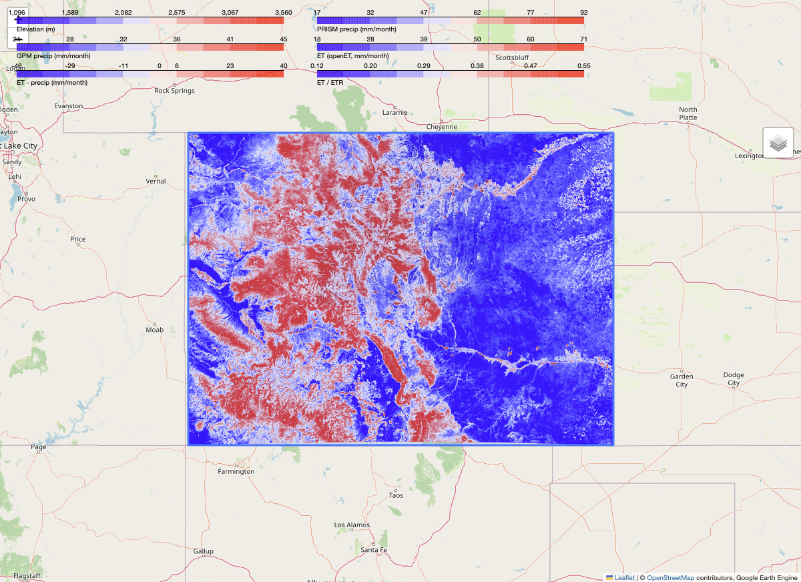
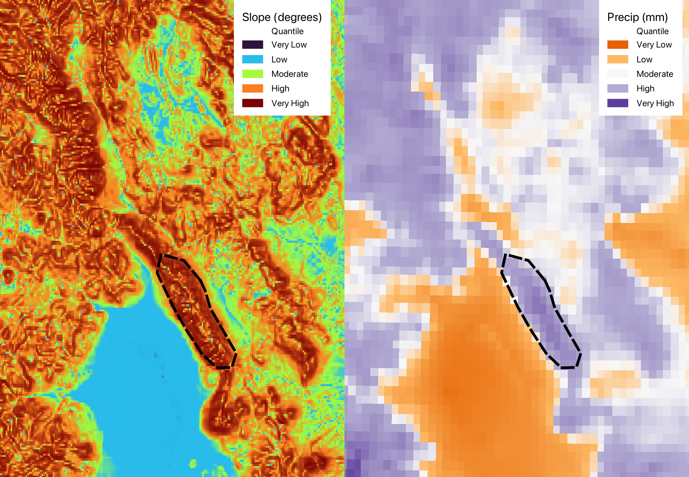
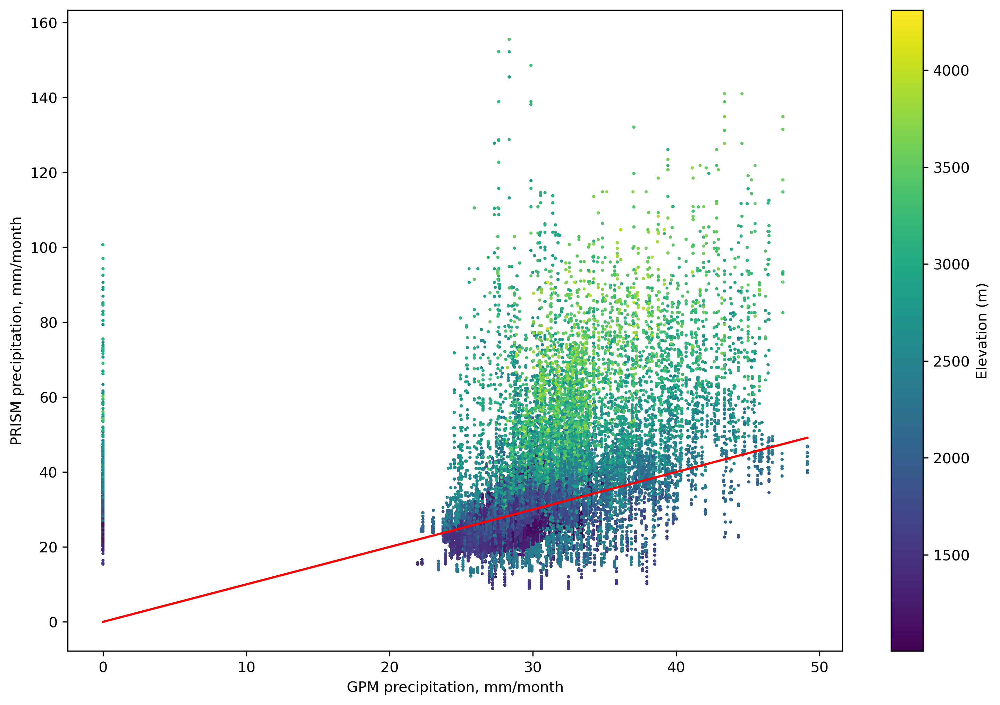
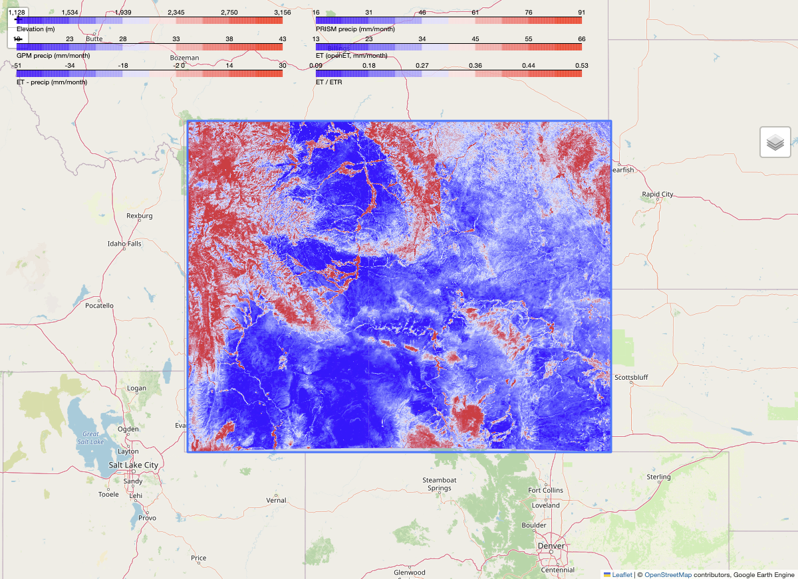
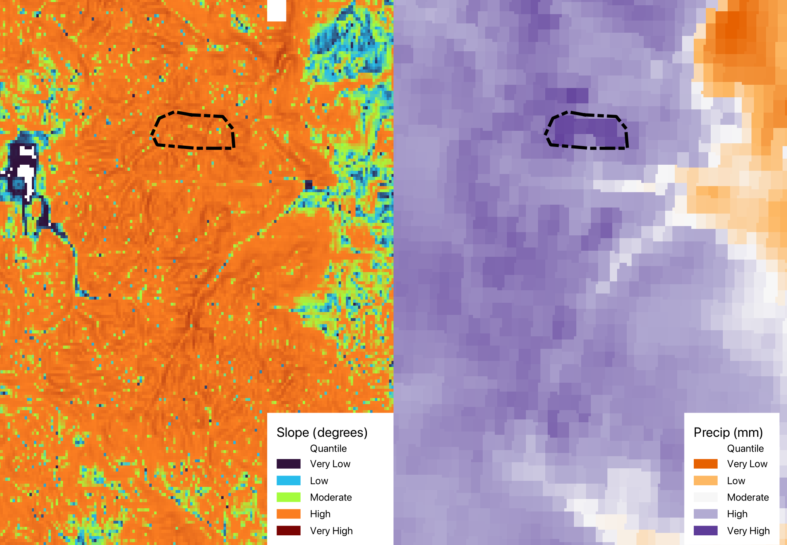
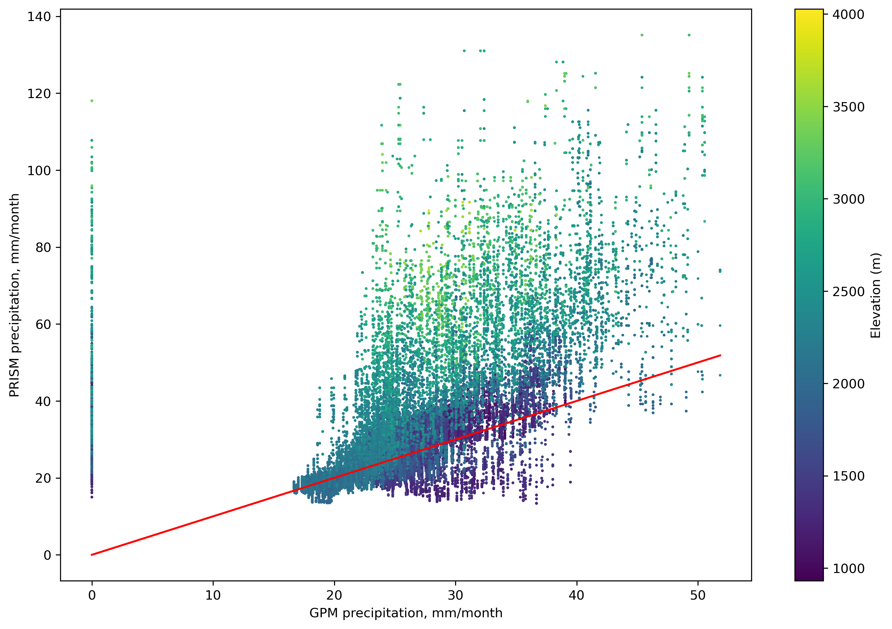

\newpage
# Setup
## Configure Python support and Miniconda environment
```{r setup}
knitr::opts_chunk$set(echo = TRUE)
library(reticulate)
library(htmltools) # for displaying HTML maps

# Config parameters
envname <- "cive580c3"
packages <- c("python=3.11", 
              "pip", 
              "numpy", 
              "matplotlib", 
              "pandas", 
              "geopandas", 
              "rasterstats",
              "earthengine-api",
              "folium",
              "branca", 
              "selenium", 
              "tqdm", 
              "rasterio")

# Install Miniconda (first time only)
#install_miniconda(force = T)

# Create environment (first time only)
#conda_remove(envname, packages = NULL, conda = "auto") # remove env if necessary
#conda_create(envname, forge = T, packages = packages) # create new env
#conda_list(conda = "auto") # check that the new env is listed

# Use the new environment for reticulate
use_miniconda(envname)
```

## Load dependencies
```{python load-dependencies}
import os
import time
import numpy as np
import pandas as pd
import geopandas as gpd
import matplotlib
from matplotlib import pyplot as plt
import ee
import folium
import numpy as np
import requests
import zipfile
from tqdm import tqdm
import branca.colormap as cm
import selenium
from selenium import webdriver
from selenium.webdriver.chrome.service import Service
import rasterio
from rasterio.warp import reproject, Resampling

# Define common CRS to use
output_crs = "OGC:CRS83"

# Authenticate Google Earth Engine
ee.Authenticate()
ee.Initialize(project='ee-cive580c3-lecture3')
```

## Define Functions
```{python functions}
# functions needed for this lab (and some other useful ones that you can use if you're interested)

# this function is used to add a google earth engine layer to an existing folium map,
# for visualization purposes. Folium is a python package that can put rasters/shapefiles on a basemap
# the function below is run using an existing folium map. If the folium map defines is my_map, then
# my_map.add_ee_layer(ee_object,name)
# where ee_object is the object defined in google earth engine, and name is the label in folium
def add_ee_layer(self, ee_object, name):
    try:
        # display ee.Image()
        if isinstance(ee_object, ee.image.Image):
            range = ee.Image(ee_object).reduceRegion(ee.Reducer.percentile([1, 99]),scale=10000)
            vals = range.getInfo()
            min=list(vals.items())[0][1]
            max=list(vals.items())[1][1]
            vis = {'min': min, 'max': max, 'palette': ['0000FF', 'FFFFFF','FF0000']}

            map_id_dict = ee.Image(ee_object).getMapId(vis)
            folium.raster_layers.TileLayer(
            tiles = map_id_dict['tile_fetcher'].url_format,
            attr = 'Google Earth Engine',
            name = name,
            overlay = True,
            control = True
            ).add_to(self)
            colormap = cm.LinearColormap(vmin=min,vmax=max,colors=['blue', 'white','red']).to_step(n=10)
            colormap.caption=name
            self.add_child(colormap)
        # display ee.ImageCollection()
        elif isinstance(ee_object, ee.imagecollection.ImageCollection):
            ee_object_new = ee_object.mosaic()
            map_id_dict = ee.Image(ee_object_new).getMapId(vis_params)
            folium.raster_layers.TileLayer(
            tiles = map_id_dict['tile_fetcher'].url_format,
            attr = 'Google Earth Engine',
            name = name,
            overlay = True,
            control = True
            ).add_to(self)
        # display ee.Geometry()
        elif isinstance(ee_object, ee.geometry.Geometry):
            folium.GeoJson(
            data = ee_object.getInfo(),
            name = name,
            overlay = True,
            control = True
        ).add_to(self)
        # display ee.FeatureCollection()
        elif isinstance(ee_object, ee.featurecollection.FeatureCollection):
            ee_object_new = ee.Image().paint(ee_object, 0, 2)
            map_id_dict = ee.Image(ee_object_new).getMapId(vis_params)
            folium.raster_layers.TileLayer(
            tiles = map_id_dict['tile_fetcher'].url_format,
            attr = 'Google Earth Engine',
            name = name,
            overlay = True,
            control = True
        ).add_to(self)

    except Exception as e:
        print("Could not display {}".format(name))
        print(e)

# to convert a google earth engine image to a python array
def to_array(img,aoi):
  band_arrs = img.sampleRectangle(region=aoi,properties=['scale=1000'],defaultValue=-999)

  band_names=img.bandNames().getInfo()

  for kk in range(len(band_names)):
    if kk==0:
      dat1=np.array(band_arrs.get(band_names[kk]).getInfo())
      dat_full=np.zeros((dat1.shape[0],dat1.shape[1],len(band_names)))
      dat_full[:,:,kk]=dat1
    else:
      dat=np.array(band_arrs.get(band_names[kk]).getInfo())
      dat_full[:,:,kk]=dat
  return(dat_full)

# to calculate an index
def getIndex(image,b1,b2):
  return image.normalizedDifference([b1, b2])

# to calculate a ratio
def getRatio(image1,image2):
  ratio=image1.divide(image2)
  return ratio

# to create a color map from a specific image
def getVisparams(image,aoi):
  range = image.reduceRegion(ee.Reducer.percentile([1, 99]),aoi,300)
  vals = range.getInfo()
  min=list(vals.items())[0][1]
  max=list(vals.items())[1][1]
  visParams = {'min': min, 'max': max, 'palette': ['0000FF', 'FFFFFF','FF0000']}
  return(visParams)

# to get the link to download an earth engine image
def getLink(image,aoi):
  link = image.getDownloadURL({
    'scale': 1000,
    'crs': 'EPSG:4326',
    'fileFormat': 'GeoTIFF',
    'region': aoi})
  print(link)

# create an earth engine geometry polygon
def addGeometry(min_lon,max_lon,min_lat,max_lat):

  geom = ee.Geometry.Polygon(
      [[[min_lon, max_lat],
        [min_lon, min_lat],
        [max_lon, min_lat],
        [max_lon, max_lat]]])
  return(geom)

# load prism data
def get_prism_image(date1,date2,geometry):

  prism = ee.ImageCollection('OREGONSTATE/PRISM/AN81m')
  prism_img = prism.filterDate(date1,date2).select('ppt').mean().clip(geometry)
  return(prism_img) # returns prism average monthly precipitation, in mm

# load landsat 8 data
def get_l8_image(date1,date2,geometry):

  l8 = ee.ImageCollection('LANDSAT/LC08/C01/T1_RT')
  l8_img = l8.filterDate(date1,date2).mean().clip(geometry)
  return(l8_img)

# to export an image to google drive
def export_to_drive(raster,filename,foldername,geometry):
  # Export the image, specifying scale and region.
  task = ee.batch.Export.image.toDrive(**{
      'image': raster,
      'description': filename,
      'folder': foldername,
      'fileNamePrefix': filename,
      'scale': 1000,
      'region': geometry,
      'fileFormat': 'GeoTIFF',
      'formatOptions': {
        'cloudOptimized': 'true'
      },
  })
  task.start()

# to create an elevation raster from the USGS NED in google earth engine from a user-defined geometry
def get_elev(geometry):

  elev = ee.Image('USGS/NED').clip(geometry)
  return(elev)

# to create an elevation raster from the SRTM in google earth engine from a user-defined geometry
def get_srtm(geometry):

  elev = ee.Image('USGS/SRTMGL1_003').clip(geometry)
  return(elev)

# to create a temporally averaged precipitation raster from GPM from a user-defined geometry
def get_gpm_image(date1,date2,geometry):

  gpm = ee.ImageCollection('NASA/GPM_L3/IMERG_MONTHLY_V07')
  gpm_img = gpm.filterDate(date1,date2).select('precipitation').mean().multiply(24*365/12).clip(geometry) # convert from mm/hour to mm/month
  return(gpm_img) # returns gpm average monthly precipitation in mm

# to create a temporally averaged actual ET raster from the openET ensemble from a user-defined geometry
def get_openET_image(date1,date2,geometry):

  openET = ee.ImageCollection('OpenET/ENSEMBLE/CONUS/GRIDMET/MONTHLY/v2_0')
  openET_img = openET.filterDate(date1,date2).select('et_ensemble_mad').mean().clip(geometry)
  return(openET_img)

# to create a temporally averaged reference ET raster from the openET ensemble from a user-defined geometry
def get_RET(date1,date2,geometry):

  ETR = ee.ImageCollection('IDAHO_EPSCOR/GRIDMET')
  ETR_image = ETR.filterDate(date1,date2).select('etr').mean().multiply(365/12).clip(geometry) # convert from mm/day to mm/month
  return(ETR_image)

# load sentinel 2 data
def get_s2_image(date1,date2,geometry):

    s2 = ee.ImageCollection('COPERNICUS/S2')
    s2_img = s2.filterDate(date1,date2).filterBounds(geometry).first().clip(geometry)
    return(s2_img)

# to get the link to download an earth engine image
def getLink(image,fname,aoi,scale=1000):
  link = image.getDownloadURL({
    'scale': scale,
    'crs': 'EPSG:4326',
    'fileFormat': 'GeoTIFF',
    'region': aoi,
    'name': fname})
  # print(link)
  return(link)

def download_img(img,geom,fname,scale=1000):
    linkname = getLink(img,fname,geom,scale=scale)
    response = requests.get(linkname, stream=True)
    zipped = fname+'.zip'
    with open(zipped, "wb") as handle:
        for data in tqdm(response.iter_content()):
            handle.write(data)

    with zipfile.ZipFile(zipped, 'r') as zip_ref:
        zip_ref.extractall('')
    os.remove(zipped)

# Add EE drawing method to folium (not a function)
folium.Map.add_ee_layer = add_ee_layer
```

\newpage
# Part 1: Viewing precipitation data for a given geometry and date
## Setup project
```{python load-data}
# create a bounding box that defines the study area
geom = addGeometry(-109, -102, 37, 41) # min long, max long, min lat, max lat

# define dates of interest (inclusive).
start = '2021-10-01'
end = '2022-10-01' #can go up to april 2021

# get elevation data
elev = get_elev(geom)

# now get gpm precipitation over the same region for a specified time period
gpm_img = get_gpm_image(start,end,geom)

# now get prism precipitation over the same time period/region
prism_img = get_prism_image(start,end,geom)

# now get actual ET from openET over the same time period/region
openET_img = get_openET_image(start,end,geom)

# now get reference ET
RET = get_RET(start,end,geom)
```

## Create map
```{python create-map}
my_map = folium.Map(location=[39, -105.5], zoom_start=7)

# Add the land cover to the map object.
#my_map.add_ee_layer(l8_img,'Landsat 8')
my_map.add_ee_layer(geom,'bounding box')
my_map.add_ee_layer(elev,'Elevation (m)')
my_map.add_ee_layer(prism_img,'PRISM precip (mm/month)')
my_map.add_ee_layer(gpm_img,'GPM precip (mm/month)')
my_map.add_ee_layer(openET_img,'ET (openET, mm/month)')
```

## Compare monthly ET to monthly P
```{python compare-data}
ET_precip = openET_img.subtract(prism_img)
my_map.add_ee_layer(ET_precip,'ET - precip (mm/month)')

ET_ETR = openET_img.divide(RET)
my_map.add_ee_layer(ET_ETR,'ET / ETR')

# Add a layer control panel to the map.
my_map.add_child(folium.LayerControl())

# Display the map (for use with Google Colab)
#display(my_map)

# Save map using Selenium as HTML (for use with RStudio)
# NOTE: requires `brew install chromedriver`
my_map.save("map_CO.html")

# Specify the correct path to chromedriver
chrome_driver_path = "/opt/homebrew/bin/chromedriver"  # Adjust as needed

options = webdriver.ChromeOptions()
options.add_argument("--headless")  # Run without opening a browser window

# Debugging output
html_path = os.path.abspath("map_CO.html")  # Ensure absolute path
print(f"Loading file: {html_path}")

service = Service(chrome_driver_path)
driver = webdriver.Chrome(service=service, options=options)

try:
    driver.get(f"file://{html_path}")  # Ensure proper file URL format
    
    # Wait for the page to fully load
    time.sleep(10)
    
    driver.save_screenshot("map_CO.png")
    
    print("Screenshot saved successfully.")
except Exception as e:
    print(f"Error loading page: {e}")

driver.quit()
```

## Display map
```{r show-map, echo=FALSE, out.width="100%"}

```

There are significant differences between precipitation estimates from PRISM and GPM. GPM shows more precipitation east of the mountains, while PRISM shows more in higher elevation areas. This is consistent with my understanding of PRISM as an _orographically corrected_ precipitation dataset, and my guess would be that GPM is underestimating precipitation in the mountains.

The difference between ET and P is generally positive (ET > P) in lower areas and negative (ET < P) in higher areas. This general pattern makes sense given the aforementioned precipitation that is likely to be present in response to orographic uplift, as well as the likelihood that ET decreases at higher elevations, which are cooler. Much of this precipitation is likely deposited as snow during much of the year. The difference between ET and P is also more positive in lowland areas such as river valley and ravines, which makes sense given the propensity for runoff and groundwater to concentrate in these areas. 

The ratio of $ET_{P}$ to $ET_{R}$ (shown in the figure above) is effectively a distributed estimate of the crop coefficient, $K_{c}$. 

## Export data
```{python export-data}
#download_img(gpm_img,geom,'lab2_gpm_precip_CO')
#download_img(prism_img,geom,'lab2_prism_precip_CO')
#download_img(elev,geom,'lab2_elev_CO')
```

## Show landslide risk area
```{r show-landslide, echo=FALSE, out.width="100%"}

```

The minimum precipitation across the entire area (Colorado) was 8.86 mm/month and the maximum was 155.53 mm/month. 

## Load rasters with `rasterio`
```{python load-rasters}
gpm=rasterio.open('lab2_gpm_precip_CO.precipitation.tif')
prism=rasterio.open('lab2_prism_precip_CO.ppt.tif')
elev=rasterio.open('lab2_elev_CO.elevation.tif')
```

## Plot PRISM vs GPM
```{python precip-crossplot}
gpm_flat = gpm.read().flatten()
prism_flat = prism.read().flatten()
elev_flat = elev.read().flatten()

plt.figure(figsize=(12,8))
plt.scatter(gpm_flat, prism_flat, c=elev_flat, s=1)
reference_line = [np.nanmin(gpm_flat), np.nanmax(gpm_flat)]
plt.plot(reference_line, reference_line, 'r')
plt.xlabel('GPM precipitation, mm/month')
plt.ylabel('PRISM precipitation, mm/month')
plt.colorbar(label="Elevation (m)")

# Save figure instead of showing it
plt.savefig("scatter_plot_CO.png", dpi=300, bbox_inches='tight')  
plt.close()  # Prevents display in interactive mode
```

```{r show-crossplot, echo=FALSE, out.width="100%"}

```

It was stated that PRISM is generally considered more accurate and, as noted above, this is likely due in part to the fact that it is orographically corrected (at least in this mountainous region). The scatter plot reinforces this in several ways. First, there are a number of pixels that show zero precipitation for GPM but non-zero values for PRISM, indicating potential missed values (though this could also be an artifact of raster pixel alignment). Second, the overall trend shows a significant underprediction of precipitation from GPM relative to PRISM. Third, the spread of PRISM values for any given value of GPM is much higher than the inverse relationship, potentially indicating low confidence in individual GPM values. Last, the discrepancies between PRISM and GPM appear largest at higher elevations.

\newpage
# Part 2: Repeated for my study area
## Load data
The study area for my term project will very likely be the state of Colorado, so just for something different I'll do this again for the state of Wyoming.

```{python load-data2}
# create a bounding box that defines the study area
geom = addGeometry(-111, -104, 41, 45) # min long, max long, min lat, max lat

# define dates of interest (inclusive).
start = '2021-10-01'
end = '2022-10-01' #can go up to april 2021

# get elevation data
elev = get_elev(geom)

# now get gpm precipitation over the same region for a specified time period
gpm_img = get_gpm_image(start,end,geom)

# now get prism precipitation over the same time period/region
prism_img = get_prism_image(start,end,geom)

# now get actual ET from openET over the same time period/region
openET_img = get_openET_image(start,end,geom)

# now get reference ET
RET = get_RET(start,end,geom)
```

## Create map
```{python create-map2}
my_map = folium.Map(location=[43, -107.5], zoom_start=7)

# Add the land cover to the map object.
#my_map.add_ee_layer(l8_img,'Landsat 8')
my_map.add_ee_layer(geom,'bounding box')
my_map.add_ee_layer(elev,'Elevation (m)')
my_map.add_ee_layer(prism_img,'PRISM precip (mm/month)')
my_map.add_ee_layer(gpm_img,'GPM precip (mm/month)')
my_map.add_ee_layer(openET_img,'ET (openET, mm/month)')
```

## Compare monthly ET to monthly P
```{python compare-data2}
ET_precip = openET_img.subtract(prism_img)
my_map.add_ee_layer(ET_precip,'ET - precip (mm/month)')

ET_ETR = openET_img.divide(RET)
my_map.add_ee_layer(ET_ETR,'ET / ETR')

# Add a layer control panel to the map.
my_map.add_child(folium.LayerControl())

# Display the map (for use with Google Colab)
#display(my_map)

# Save map using Selenium as HTML (for use with RStudio)
# NOTE: requires `brew install chromedriver`
my_map.save("map_WY.html")

# Specify the correct path to chromedriver
chrome_driver_path = "/opt/homebrew/bin/chromedriver"  # Adjust as needed

options = webdriver.ChromeOptions()
options.add_argument("--headless")  # Run without opening a browser window

# Debugging output
html_path = os.path.abspath("map_WY.html")  # Ensure absolute path
print(f"Loading file: {html_path}")

service = Service(chrome_driver_path)
driver = webdriver.Chrome(service=service, options=options)

try:
    driver.get(f"file://{html_path}")  # Ensure proper file URL format
    
    # Wait for the page to fully load
    time.sleep(10)
    
    driver.save_screenshot("map_WY.png")
    
    print("Screenshot saved successfully.")
except Exception as e:
    print(f"Error loading page: {e}")

driver.quit()
```

## Display map
```{r show-map2, echo=FALSE, out.width="100%"}

```

## Export data
```{python export-data2}
#download_img(gpm_img,geom,'lab2_gpm_precip_WY')
#download_img(prism_img,geom,'lab2_prism_precip_WY')
#download_img(elev,geom,'lab2_elev_WY')
```

## Show landslide risk area
```{r show-landslide2, echo=FALSE, out.width="100%"}

```

The minimum precipitation across the entire area (Wyoming) was 13.37 mm/month and the maximum was 135.13 mm/month. 

## Load rasters with `rasterio`
```{python load-rasters2}
gpm=rasterio.open('lab2_gpm_precip_WY.precipitation.tif')
prism=rasterio.open('lab2_prism_precip_WY.ppt.tif')
elev=rasterio.open('lab2_elev_WY.elevation.tif')
```

## Plot PRISM vs GPM
```{python precip-crossplot2}
gpm_flat = gpm.read().flatten()
prism_flat = prism.read().flatten()
elev_flat = elev.read().flatten()

plt.figure(figsize=(12,8))
plt.scatter(gpm_flat, prism_flat, c=elev_flat, s=1)
reference_line = [np.nanmin(gpm_flat), np.nanmax(gpm_flat)]
plt.plot(reference_line, reference_line, 'r')
plt.xlabel('GPM precipitation, mm/month')
plt.ylabel('PRISM precipitation, mm/month')
plt.colorbar(label="Elevation (m)")

# Save figure instead of showing it
plt.savefig("scatter_plot_WY.png", dpi=300, bbox_inches='tight')  
plt.close()  # Prevents display in interactive mode
```

```{r show-crossplot2, echo=FALSE, out.width="100%"}

```