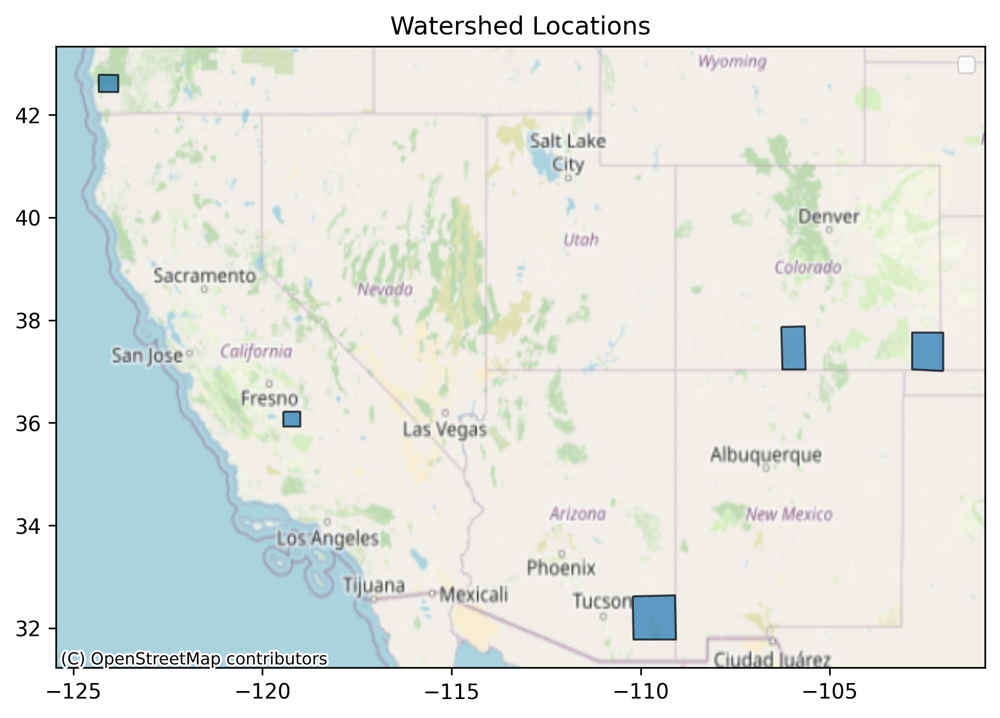

\newpage
# Setup
```{r setup, include=F}
knitr::opts_chunk$set(echo = TRUE)
library(reticulate)
```

## Authenticate EE
```{python authenticate, eval=FALSE}
## Due to issues with compatibility between `geemap` and RStudio,
## this code is all run in a Jupyter notebook and archived here for posterity

# you only need to run this once per session
ee.Authenticate()
ee.Initialize(project='ee-cive580c3-lecture3')
```

## Define Functions
```{python define-functions, eval=FALSE}
def add_ee_layer(self, ee_object, name):
    try:
        # display ee.Image()
        if isinstance(ee_object, ee.image.Image):
            range = ee.Image(ee_object).reduceRegion(ee.Reducer.percentile([1, 99]),scale=10000)
            vals = range.getInfo()
            min=list(vals.items())[0][1]
            max=list(vals.items())[1][1]
            vis = {'min': min, 'max': max, 'palette': ['0000FF', 'FFFFFF','FF0000']}

            map_id_dict = ee.Image(ee_object).getMapId(vis)
            folium.raster_layers.TileLayer(
            tiles = map_id_dict['tile_fetcher'].url_format,
            attr = 'Google Earth Engine',
            name = name,
            overlay = True,
            control = True
            ).add_to(self)
            colormap = cm.LinearColormap(vmin=min,vmax=max,colors=['blue', 'white','red']).to_step(n=10)
            colormap.caption=name
            self.add_child(colormap)
        # display ee.ImageCollection()
        elif isinstance(ee_object, ee.imagecollection.ImageCollection):
            ee_object_new = ee_object.mosaic()
            map_id_dict = ee.Image(ee_object_new).getMapId(vis_params)
            folium.raster_layers.TileLayer(
            tiles = map_id_dict['tile_fetcher'].url_format,
            attr = 'Google Earth Engine',
            name = name,
            overlay = True,
            control = True
            ).add_to(self)
        # display ee.Geometry()
        elif isinstance(ee_object, ee.geometry.Geometry):
            folium.GeoJson(
            data = ee_object.getInfo(),
            name = name,
            overlay = True,
            control = True
        ).add_to(self)
        # display ee.FeatureCollection()
        elif isinstance(ee_object, ee.featurecollection.FeatureCollection):
            ee_object_new = ee.Image().paint(ee_object, 0, 2)
            map_id_dict = ee.Image(ee_object_new).getMapId(vis_params)
            folium.raster_layers.TileLayer(
            tiles = map_id_dict['tile_fetcher'].url_format,
            attr = 'Google Earth Engine',
            name = name,
            overlay = True,
            control = True
        ).add_to(self)

    except Exception as e:
        print("Could not display {}".format(name))
        print(e)

# Add EE drawing method to folium (not a function)
folium.Map.add_ee_layer = add_ee_layer

def create_reduce_region_function(geometry,
                                  reducer=ee.Reducer.mean(),
                                  scale=1000,
                                  crs='EPSG:4326',
                                  bestEffort=True,
                                  maxPixels=1e13,
                                  tileScale=4):
  """Creates a region reduction function.

  Creates a region reduction function intended to be used as the input function
  to ee.ImageCollection.map() for reducing pixels intersecting a provided region
  to a statistic for each image in a collection. See ee.Image.reduceRegion()
  documentation for more details.

  Args:
    geometry:
      An ee.Geometry that defines the region over which to reduce data.
    reducer:
      Optional; An ee.Reducer that defines the reduction method.
    scale:
      Optional; A number that defines the nominal scale in meters of the
      projection to work in.
    crs:
      Optional; An ee.Projection or EPSG string ('EPSG:5070') that defines
      the projection to work in.
    bestEffort:
      Optional; A Boolean indicator for whether to use a larger scale if the
      geometry contains too many pixels at the given scale for the operation
      to succeed.
    maxPixels:
      Optional; A number specifying the maximum number of pixels to reduce.
    tileScale:
      Optional; A number representing the scaling factor used to reduce
      aggregation tile size; using a larger tileScale (e.g. 2 or 4) may enable
      computations that run out of memory with the default.

  Returns:
    A function that accepts an ee.Image and reduces it by region, according to
    the provided arguments.
  """

  def reduce_region_function(img):
    """Applies the ee.Image.reduceRegion() method.

    Args:
      img:
        An ee.Image to reduce to a statistic by region.

    Returns:
      An ee.Feature that contains properties representing the image region
      reduction results per band and the image timestamp formatted as
      milliseconds from Unix epoch (included to enable time series plotting).
    """

    stat = img.reduceRegion(
        reducer=reducer,
        geometry=geometry,
        scale=scale,
        crs=crs,
        bestEffort=bestEffort,
        maxPixels=maxPixels,
        tileScale=tileScale)

    return ee.Feature(geometry, stat).set({'millis': img.date().millis()})
  return reduce_region_function

def gee_zonal_mean_img_coll(imageCollection,geometry,scale=1000):
    reduce_iC = create_reduce_region_function(geometry = geometry, scale=scale)
    stat_fc = ee.FeatureCollection(imageCollection.map(reduce_iC)).filter(ee.Filter.notNull(imageCollection.first().bandNames()))
    fc_dict = fc_to_dict(stat_fc).getInfo()

    df = pd.DataFrame(fc_dict)
    df['date'] = pd.to_datetime(df['millis'],unit='ms')
    return(df)

def gee_zonal_mean(date1,date2,geometry,collection_name,band_name,scale=1000):
     imcol = ee.ImageCollection(collection_name).select(band_name).filterDate(date1,date2)
     df = gee_zonal_mean_img_coll(imcol,geometry,scale=scale)
     return(df)


# Define a function to transfer feature properties to a dictionary.
def fc_to_dict(fc):
  prop_names = fc.first().propertyNames()
  prop_lists = fc.reduceColumns(
      reducer=ee.Reducer.toList().repeat(prop_names.size()),
      selectors=prop_names).get('list')

  return ee.Dictionary.fromLists(prop_names, prop_lists)

def ee_imgcoll_to_df_point(imagecollection, lat,lon):
    """Transforms client-side ee.Image.getRegion array to pandas.DataFrame."""
    poi = ee.Geometry.Point(lon, lat)
    arr = imagecollection.getRegion(poi,1000).getInfo()

    list_of_bands = imagecollection.first().bandNames().getInfo()

    df = pd.DataFrame(arr)

    # Rearrange the header.
    headers = df.iloc[0]
    df = pd.DataFrame(df.values[1:], columns=headers)

    # Remove rows without data inside.
    df = df[['longitude', 'latitude', 'time', *list_of_bands]].dropna()

    # Convert the data to numeric values.
    for band in list_of_bands:
        df[band] = pd.to_numeric(df[band], errors='coerce')

    # Convert the time field into a datetime.
    df['datetime'] = pd.to_datetime(df['time'], unit='ms')

    # Keep the columns of interest.
    df = df[['time','datetime',  *list_of_bands]]

    return df

# to get the link to download an earth engine image
def getLink(image,fname,aoi):
  link = image.getDownloadURL({
    'scale': 1000,
    'crs': 'EPSG:4326',
    'fileFormat': 'GeoTIFF',
    'region': aoi,
    'name': fname})
  # print(link)
  return(link)

# create an earth engine geometry polygon
def addGeometry(min_lon,max_lon,min_lat,max_lat):
  geom = ee.Geometry.Polygon(
      [[[min_lon, max_lat],
        [min_lon, min_lat],
        [max_lon, min_lat],
        [max_lon, max_lat]]])
  return(geom)

def get_imgcollection(date1,date2,geometry,collection_name,band_name,function='mean'):
  collection = ee.ImageCollection(collection_name)
  if function=='mean':
      img = collection.filterDate(date1,date2).select(band_name).mean().clip(geometry)
  if function=='sum':
      img = collection.filterDate(date1,date2).select(band_name).sum().clip(geometry)
 # range = img.reduceRegion(ee.Reducer.percentile([1, 99]),scale=10000)
 # vals = range.getInfo()
 # min=list(vals.items())[0][1]
 # max=list(vals.items())[1][1]
 # visParams = {'min': min, 'max': max, 'palette': ['0000FF', 'FFFFFF','FF0000']}
  return(img)

def download_img(img,geom,fname):
    linkname = getLink(img,fname,geom)
    response = requests.get(linkname, stream=True)
    zipped = fname+'.zip'
    with open(zipped, "wb") as handle:
        for data in tqdm(response.iter_content()):
            handle.write(data)

    with zipfile.ZipFile(zipped, 'r') as zip_ref:
        zip_ref.extractall('')
    os.remove(zipped)


def aggregate_by_water_year(df,date_col,agg_column,agg_fun='sum'):
    df['water_year'] = df[date_col].dt.year.where(df[date_col].dt.month < 10, df[date_col].dt.year + 1)
    df_agg = df.groupby('water_year').agg({agg_column:[agg_fun]})
    return(df_agg)
```

\newpage
# Part 1: Gather and plot water balance data over pre-defined regions
```{python load-data, eval=FALSE}
start='2020-04-01'
end='2020-09-30'
from glob import glob
paths = glob('/content/CIVE580C3/data/hw3/*.shp')

# upload watershed to GEE----------------------------
gee_wsheds = []
for kk in range(len(paths)):
  gee_wsheds.append(geemap.shp_to_ee(paths[kk]))
  
# Create a figure and axis
fig, ax = plt.subplots(figsize=(8, 6))

# Loop through shapefiles and plot each one
for path in paths:
    shp = gpd.read_file(path)
    shpname = path.split('/')[-1].split('.')[0]
    shp.plot(ax=ax, label=shpname, edgecolor='black', alpha=0.7)

# Add an OSM basemap
ctx.add_basemap(ax, crs=shp.crs, source=ctx.providers.OpenStreetMap.Mapnik)

# Add labels and legend
ax.set_title("Watershed Locations")
ax.legend()

# Show plot
plt.show()
```

```{r display-map1}

```

```{python get-time-series1}
# take the spatial mean to get area-averaged time series over each shapefile. This will take a few minutes
for kk, watershed in enumerate(watersheds):
  print(kk)

  fname_stem = paths[kk].split('/')[-1].split('.')[0]

  gridmet_ppt = gee_zonal_mean(start,end,watershed_gee.geometry(),'IDAHO_EPSCOR/GRIDMET','pr',scale=10000)
  gridmet_ppt = gridmet_ppt[['pr','date']].set_index('date')
  gridmet_ppt.index = gridmet_ppt.index.to_period('D')

  gridmet_eto = gee_zonal_mean(start,end,watershed_gee.geometry(),'IDAHO_EPSCOR/GRIDMET','eto',scale=10000)
  gridmet_eto = gridmet_eto[['eto','date']].set_index('date')
  gridmet_eto.index = gridmet_eto.index.to_period('D')

  soil_moisture_df = gee_zonal_mean(start,end,watershed_gee.geometry(),'NASA/SMAP/SPL3SMP_E/006','soil_moisture_am',scale=10000)
  soil_moisture_df = soil_moisture_df[['soil_moisture_am','date']].set_index('date')
  soil_moisture_df.index = soil_moisture_df.index.to_period('D')

  # join dataframes

  merged_df = gridmet_ppt[['pr']].join(gridmet_eto[['eto']]).join(soil_moisture_df[['soil_moisture_am']])

  merged_df.to_csv(fname_stem+'_merged_data.csv')
  
csv_files = glob('*.csv')
print(csv_files)
```

Now, create plots similar to the plot below for each of the time series generated. You can do this in python, Excel, or any other tool of your choosing, but the plots should clearly show precipitation, ETo, and soil moisture with a consistent x-axis, so that it is easy to determine the effect of each on soil moisture. Include the plots in a word document that you will turn in with the project, along with your code.

After generating the plots, comment on similarities and differences among the regions. In your evaluation, include interpretation of the response of soil moisture to different drivers (precip, ETo as well as other potential drivers).

In addition to qualitative interpretations, provide some quantitative evaluation of either soil moisture trends or soil moisture response to external drivers for each region (this is intentionally vague--you may choose what and how to quantify).

Note that this portion of the exercise can also be done in python, Excel or with any other tool, so long as it is your own work. In your report, describe what tool you used, and turn in any code you used.